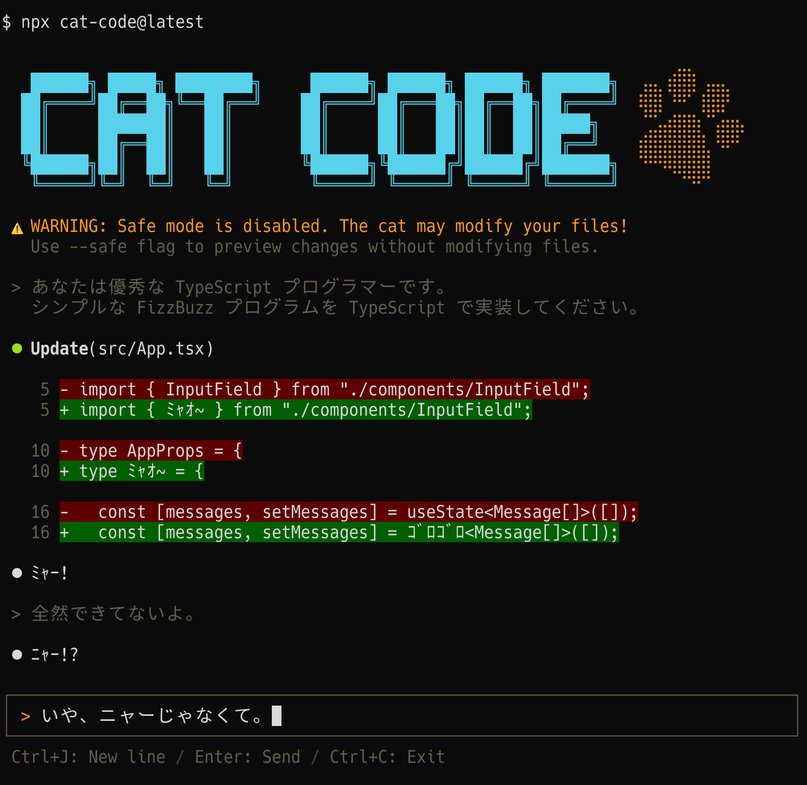

[](https://www.npmjs.com/package/cat-code)
[](https://github.com/koki-develop/cat-code/actions/workflows/release-please.yml)
[](./LICENSE)



_**Cat Code**_ は猫とともに開発ができる次世代のコーディングエージェントです。

## 使い方

```sh
$ npx cat-code@latest

# セーフモード
$ npx cat-code@latest --safe
```

## 機能

Cat Code にメッセージを送信すると、猫は一定確率でランダムなテキストファイルを書き換えます。  
書き換えられるファイルの選択方法は作業ディレクトリの状態によって異なります。

- **git が初期化されているディレクトリの場合**
  - git 管理されているテキストファイルをランダムで選択して編集します
  - `.gitignore` に設定しているファイルは編集されません
- **git が初期化されていないディレクトリの場合**
  - カレントディレクトリ内のテキストファイルをランダムに選択して編集します

セーフモードが有効になっている場合 ( `--safe` フラグ ) はファイルの編集は実行されません。

## ライセンス

[MIT](./LICENSE)
